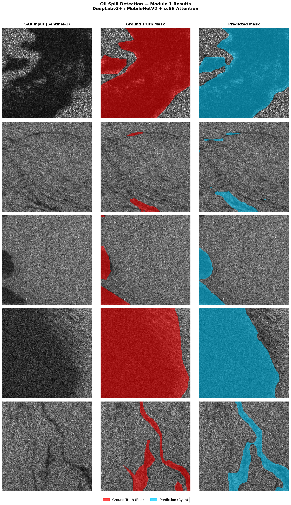

# Module 1: Initial Stage (Baseline Model)

## Architecture
- **Model**: DeepLabv3+
- **Backbone**: MobileNetV3-Large
- **Attention**: Custom scSE (Spatial and Channel Squeeze-and-Excitation) Block
- **Input Channels**: 3 (Grayscale SAR converted to 3-channel RGB)
- **Output Classes**: 1 (Binary Segmentation - Oil Spill vs Background)
- **Total Parameters**: 11,136,498

## Training Setup
- **Dataset**: SOS (Deep-SAR Oil Spill) - Sentinel Subset
- **Train Samples**: 2,851
- **Validation Samples**: 503
- **Test Samples**: 839
- **Image Size**: 256x256
- **Epochs**: 30
- **Batch Size**: 8
- **Learning Rate**: 2e-4
- **Loss Function**: BCE + Soft Dice Loss (bce_weight=0.5)

## Training Performance
*Training reached its peak validation performance around Epoch 11, though loss continued to drop.*
- **Best Validation Epoch**: 11
- **Lowest Training Loss**: 0.1524 (Epoch 30)
- **Best Validation Dice**: 0.7768
- **Best Validation IoU**: 0.6662

## Test Set Evaluation
After loading the best checkpoint (`best_model.pth`), the model was evaluated on the unseen test set (839 images).
- **Test Dice Score**: 0.7509
- **Test IoU Score**: 0.6409

## Visualizations
Visual predictions were successfully generated and saved to:
`outputs/predictions/predictions.png`

These visuals compare the **Ground Truth (Red)** against the **Model Prediction (Cyan)** overlaid directly on the raw Sentinel-1 SAR input imagery.

---
**Next Steps**: This serves as our baseline. We will now begin making modifications and improvements to the pipeline to push the test IoU score higher than 0.6409.
