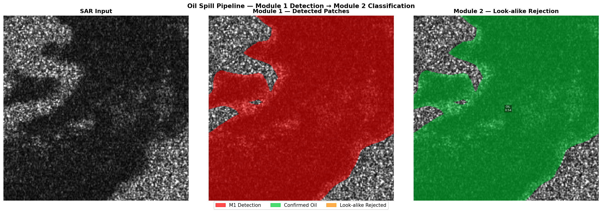

# 🛢️ Automated Detection and Vessel Attribution of Illegal Bilge Dumping
### Using Sentinel-1 SAR Imagery and AIS Data Fusion

<div align="center">


**SMVITM, Visvesvaraya Technological University — 2026-27**

</div>

---

## 📌 Problem Statement

Ships illegally discharge oily bilge water at sea — a deliberate environmental crime
that produces thin elongated dark streaks visible in Synthetic Aperture Radar (SAR)
satellite imagery. Existing systems can detect oil spills but **no validated end-to-end
pipeline exists** that automatically detects the spill, rejects false alarms, and
forensically attributes the dump to a responsible vessel.

This project builds that pipeline.

---

## 🎯 Project Objectives

- Detect oil spill regions in Sentinel-1 SAR imagery using deep learning segmentation
- Reject natural look-alike phenomena (low wind zones, algal blooms, biogenic films)
- Filter and rank candidate vessels using AIS trajectory anomaly detection
- Attribute detected spills to responsible vessels using bidirectional Lagrangian drift modelling
- Produce a transparent confidence score per attributed vessel

---

## 🏗️ System Architecture

```
Sentinel-1 SAR Input
        ↓
┌───────────────────────────────────────┐
│  MODULE 1 — SAR Preprocessing         │  ✅ Complete
│             + Oil Spill Segmentation  │
│  DeepLabv3+ / MobileNetV3-Large + scSE│
└───────────────────────────────────────┘
        ↓  Binary spill mask
┌───────────────────────────────────────┐
│  MODULE 2 — Look-alike Rejection      │  🔄 In Progress
│  Random Forest on geometric +         │
│  polarimetric + contextual features   │
└───────────────────────────────────────┘
        ↓  Confirmed spill + location
┌───────────────────────────────────────┐
│  MODULE 3 — AIS Vessel Filtering      │  ❌ Planned
│  Isolation Forest + 3D DBSCAN        │
│  Dark ship detection from SAR         │
└───────────────────────────────────────┘
        ↓  Ranked suspect vessels
┌───────────────────────────────────────┐
│  MODULE 4 — Drift Attribution         │  ❌ Planned
│  Bidirectional Lagrangian Model       │
│  + Composite Confidence Scoring       │
└───────────────────────────────────────┘
        ↓
Output: Spill Map + Vessel ID + Confidence Score
```

---

## 👥 Team

| Name | USN | Role |
|---|---|---|
| Rohith Sheregar | 4MW23CS120 | ML Pipeline, SAR Processing, AIS Integration |
| Reynol D'Souza | 4MW23CS119 | Team Lead, System Architecture |
| Prajwal Shanbhag | 4MW23CS095 | Data Processing, Evaluation |
| Nishith R Poojary | 4MW23CS087 | Drift Modelling, Visualization |

**Institution:** Shri Madhwa Vadiraja Institute of Technology and Management  
**Affiliation:** Visvesvaraya Technological University  
**Academic Year:** 2026-27 | Semester VI

---

## 📊 Current Results

### Module 1 — SAR Oil Spill Segmentation

| Metric | Validation Set | Test Set | Target |
|---|---|---|---|
| **IoU Score** | 0.6662 | **0.6409** | > 0.85 |
| **Dice Score** | 0.7768 | **0.7509** | > 0.90 |
| **Best Train Loss** | 0.1524 | — | < 0.15 |

> 📅 Last updated: May 2026 | Training: 30 epochs, SOS Sentinel subset (2,851 samples), CPU

**Training Progression (Baseline — Sentinel Only):**
```
Epoch 01 → Val IoU: 0.6234
Epoch 04 → Val IoU: 0.6540
Epoch 11 → Val IoU: 0.6662  ← Best checkpoint saved
Epoch 30 → Val IoU: 0.6530  (plateau, loss still dropping)
```

### Module 2 — Look-alike Rejection

| Component | Status | Detail |
|---|---|---|
| Feature extractor (`features.py`) | ✅ Complete | 13 geometric + contextual features per patch |
| Random Forest classifier (`classifier.py`) | ✅ Complete | 200 trees, balanced class weights |
| End-to-end pipeline (`pipeline.py`) | ✅ Complete | M1 → M2 → colour-coded visualisation |
| Classifier training (`train_module2.py`) | ✅ Complete | **Real MKLab look-alike labels** (class 2) |

```
Target   : > 80% false positive reduction
Data     : MKLab dataset (real oil_spill + look_alike labels)
Saved    : outputs/checkpoints/module2_classifier.pkl
```

### Module 3 — AIS Vessel Filtering
```
Status   : ❌ Not Started
Target   : F1 > 0.89, AUC-ROC > 0.94
Dataset  : Real AIS trajectory records
```

### Module 4 — Drift Attribution
```
Status   : ❌ Not Started
Target   : Bidirectional matching validated on
           5+ confirmed EMSA incidents
```

---

## 🖼️ Visual Results

### Module 1 — Baseline Prediction Samples
> Ground Truth (Red) vs Model Prediction (Cyan) overlaid on Sentinel-1 SAR input


*Run `python -m src.visualize` to generate `outputs/predictions/predictions.png`*

---

### Module 2 — End-to-End Pipeline Output
> SAR Input | Module 1 Detection (Red) | Module 2 Classification (Green = Oil, Orange = Look-alike)



---

## 📁 Repository Structure

```
oil-spill-sar-detection/
├── src/
│   ├── dataset.py              Data loading (SOS + MKLab) + augmentation
│   ├── model.py                Module 1 — DeepLabv3+ + scSE architecture
│   ├── train.py                Module 1 — Training loop + checkpointing
│   ├── utils.py                Module 1 — Loss functions + metrics
│   ├── visualize.py            Module 1 — Prediction visualization
│   ├── features.py             Module 2 — Geometric feature extraction
│   ├── classifier.py           Module 2 — Random Forest classifier
│   ├── pipeline.py             Module 2 — End-to-end M1 → M2 pipeline
│   └── train_module2.py        Module 2 — Classifier training (MKLab/SOS)
├── notebooks/
│   └── kaggle_training.ipynb   GPU training notebook (Kaggle T4)
├── data/
│   ├── sos/                    SOS dataset (binary: oil vs background)
│   │   ├── train/sentinel/     Sentinel-1 Persian Gulf patches
│   │   ├── train/palsar/       ALOS Gulf of Mexico patches
│   │   └── test/               Held-out test sets
│   └── mklabs/                 MKLab dataset (5-class: sea/oil/look-alike/ship/land)
│       ├── train/images/       1,002 SAR images (.jpg, 1250x650)
│       ├── train/labels_1D/    Ground truth class masks (.png)
│       └── test/               110 test samples
├── outputs/
│   ├── checkpoints/
│   │   ├── best_model.pth          Best M1 weights (gitignored)
│   │   └── module2_classifier.pkl  Trained M2 classifier (gitignored)
│   └── predictions/
│       └── pipeline_result.png     M1+M2 pipeline visualization
├── config.py                   Central configuration (dataset selector)
├── requirements.txt            Dependencies
├── evaluate.py                 Benchmark any .pth checkpoint on test set
├── smoke_test.py               Module 1 pipeline verification
├── test_module2.py             Module 2 smoke test (9 checks)
├── train_module1.py            Run Module 1 training (--dataset sos/mklab/combined)
├── train_module2.py            Run Module 2 training (--no-mklab for legacy)
└── predict_pipeline.py         Run full integrated pipeline (M1 + M2) on test data
```

---

## 🔬 Module 1 — Technical Details

### Model Architecture
```
Input: 512×512×3 SAR image (grayscale repeated to RGB)
  ↓
EfficientNet-B4 Backbone (pretrained on ImageNet)
  ~19M total parameters
  ↓
scSE Attention Block (novel contribution)
  ├── Channel Squeeze-and-Excitation (which features matter)
  └── Spatial Squeeze-and-Excitation (where in the image)
  ↓
DeepLabv3+ ASPP Classifier Head
  ↓
Bilinear Upsample → 512×512
  ↓
Output: 512×512×1 binary mask (sigmoid threshold 0.5)
```

### Design Choices
| Design Choice | Alternative | Reason |
|---|---|---|
| **EfficientNet-B4** backbone | MobileNetV3 | Compound scaling captures finer features at 512x512 resolution |
| **scSE attention** | No attention | Focuses on oil-relevant channels + spatial regions simultaneously |
| **Focal + Tversky loss** | BCE + Dice | Tversky penalises missed oil pixels (FN) 2.3× more than false alarms |
| **Mixed Precision + Warm Restarts** | Standard training | Escapes local minima and fits larger 512x512 batches into GPU memory |
| **Label smoothing ε=0.1** | Hard binary labels | Reduces overconfidence on noisy SAR annotations |
| **CLAHE augmentation** | Standard contrast | Handles SAR contrast variation across acquisition geometries |
| **Random Cropping** | Resizing | Preserves original high-res detail and physical aspect ratio of 1250x650 MKLab images by randomly extracting 256x256 windows. |
| **Gradient clipping (norm=1.0)** | None | Prevents loss spikes with combined datasets |

### Datasets

#### SOS Dataset (Baseline — Binary)
| Split | Images | Source |
|---|---|---|
| Train | 2,851 | SOS Sentinel — Persian Gulf 2017 spill |
| Validation | 503 | SOS Sentinel (15% holdout) |
| Test | 839 | SOS Sentinel — unseen set |

#### MKLab Dataset (Current — 5-Class)
| Split | Images | Source | Resolution |
|---|---|---|---|
| Train | 852 (85%) | MKLab SAR oil spill dataset | 1250x650 |
| Validation | 150 (15%) | MKLab (holdout from train) | 1250x650 |
| Test | 110 | MKLab — unseen test set | 1250x650 |

**MKLab Label Classes:**
| Class ID | Label | Usage |
|---|---|---|
| 0 | Sea Surface | Background for M1 |
| 1 | Oil Spill | Positive class for M1 + M2 |
| 2 | Look-alike | Negative class for M2 (real!) |
| 3 | Ship | Background for M1 |
| 4 | Land | Background for M1 |

> For Module 1 binary segmentation, class 1 (Oil Spill) = 1, all other classes = 0.

### Training Configuration

#### Baseline (CPU — SOS Sentinel Only)
```
Optimizer  : AdamW  (lr=2e-4)
Scheduler  : CosineAnnealingLR (T_max=30)
Loss       : BCE (label smooth ε=0.1) + Soft Dice (50/50)
Batch size : 8
Epochs     : 30
Image size : 256x256
Dataset    : Sentinel only (2,851 train samples)
Best epoch : 11  ->  Val IoU 0.6662,  Test IoU 0.6409
```

#### EfficientNet-B4 Training (Targeting 0.8+ IoU)
```
Optimizer  : AdamW  (lr=2e-4, mixed precision scaler)
Scheduler  : CosineAnnealingWarmRestarts (T_0=20, freeze first 5 epochs)
Loss       : Focal (0.4) + Tversky (0.6)
Batch size : 4
Epochs     : 60
Image size : 512x512 (random crop from 1250x650)
Dataset    : All 3 combined (SOS Sentinel + PALSAR + MKLab)
Status     : Training in progress...
```

### Module 1 Results Progression

| Run | Dataset | Strategy | Best Val IoU | Best Val Dice |
|-----|---------|----------|----------|-----------|
| Run 1 | SOS only | Resize (256x256) | 0.6409 | 0.7509 |
| Run 2 | MKLab only | Resize (256x256) | 0.4062 | 0.5139 |
| Run 3 | All 3 combined | Resize (256x256) | 0.5944 | 0.7068 |
| **Run 4** | **All 3 combined** | **Random Crop (256x256)** | **0.6479** | **0.7492** |

> *Note: Run 4 successfully restored baseline performance while training on a significantly harder, multi-sensor dataset with real look-alike labels.*

---

## 🔍 Module 2 — Look-alike Rejection

### Problem
Module 1 finds all dark patches in SAR imagery, but natural phenomena also appear
dark — low wind zones, biogenic films, algal blooms. Module 2 filters these false
positives using physical and geometric properties of the detected patch.

### Features Extracted Per Detected Patch (13 total)

| Feature Group | Features | Physical Justification |
|---|---|---|
| **Size** | `area_pixels`, `area_km2` | Bilge dumps typically 0.1–5 km² |
| **Shape** | `perimeter`, `elongation`, `aspect_ratio`, `compactness` | Dumps are thin streaks (elongation > 3); look-alikes are blob-shaped |
| **Morphology** | `solidity`, `extent` | Oil patches have irregular, jagged boundaries |
| **Texture** | `hu_moment_1`, `hu_moment_2` | Scale/rotation-invariant shape descriptors |
| **Intensity** | `mean_intensity`, `std_intensity` | Oil suppresses backscatter; look-alikes have different variance |
| **Context** | `is_night` | >80% of illegal dumps occur at night (Liao et al. 2023) |

### Classifier Architecture
```
Input  : Feature vector (N_patches × 13)
Model  : Random Forest (200 trees, balanced class weights, sqrt features)
Output : P(real oil spill) ∈ [0, 1] per patch
Filter : is_oil = True if label == 'oil_spill'
Target : > 80% false positive reduction
```

### 🗃️ Dataset Status

> [!NOTE]
> **The MKLab dataset has been fully integrated.** Module 2 now trains on **real oil_spill (class 1) and look_alike (class 2) labels** from the MKLab dataset, replacing the previous synthetic negative approach.

1. **Current State (MKLab Real Data)**: The classifier now uses ground-truth oil spill and look-alike masks from the MKLab dataset. Feature extraction runs directly on the labeled regions — no Module 1 inference needed for training data generation.
2. **Legacy Fallback**: The SOS-based synthetic negative pipeline is preserved and can be activated with `python train_module2.py --no-mklab`.
3. **Next Action**: Train Module 1 on MKLab data to establish new accuracy baseline, then proceed to **Module 3 (AIS Vessel Filtering)**.

### Pipeline Output Legend
| Colour | Meaning |
|---|---|
| 🔴 Red | Module 1 raw detection |
| 🟢 Green | Module 2 confirmed oil spill |
| 🟠 Orange | Module 2 rejected look-alike |

---

## 🚢 Module 3 — AIS Vessel Filtering (Planned)

```
1. Download AIS records for ±6 hours around SAR acquisition time
   within ±50 km of detected spill centroid

2. Clean trajectories using 3D DBSCAN
   (removes mixed-MMSI identifier artifacts)

3. Filter by vessel type: tankers, bulk carriers,
   container ships, fishing vessels > 50m

4. Anomaly detection — Isolation Forest + Random Forest hybrid
   Features: SOG variance, course deviation,
             stopping events, proximity to spill

5. Flag Tier-1 candidates for drift attribution

6. Dark ship handling: detect non-AIS vessels
   directly from Sentinel-1 SAR
```

---

## 🌊 Module 4 — Drift Attribution (Planned)

### Bidirectional Lagrangian Model
```
Forward simulation:
  Vessel position at discharge time
  + ECMWF ERA5 wind fields
  + Copernicus CMEMS ocean currents
  + Stokes drift from wave data
  → Projected spill position at SAR acquisition time

Backward simulation:
  Detected spill patch centroid
  + Time-reversed drift equations
  → Probable discharge origin point

Match score S ∈ [0, 1] per candidate vessel
```

### Composite Confidence Score
```
C = w1·S_drift + w2·S_AIS_anomaly + w3·S_morphology + w4·S_temporal

  S_drift        — bidirectional drift spatial similarity
  S_AIS_anomaly  — vessel behavioural anomaly score
  S_morphology   — geometric match to vessel heading/speed
  S_temporal     — night-time discharge probability
```

---

## 🗂️ Branch Structure

| Branch | Contents | Status |
|---|---|---|
| `main` | README + project overview | ✅ |
| `module-1` | Complete Module 1 codebase | ✅ Complete |
| `module-2` | Module 1 + look-alike rejection | 🔄 In Progress |
| `module-3` | Module 1–2 + AIS filtering | ❌ Planned |
| `module-4` | Full pipeline | ❌ Planned |

---

## ⚙️ Setup & Usage

### Prerequisites
```
Python 3.10+
CUDA GPU (recommended) or CPU
8 GB+ RAM minimum, 16 GB recommended
```

### Installation
```bash
git clone https://github.com/<your-username>/oil-spill-sar-detection
cd oil-spill-sar-detection
git checkout module-2

python -m venv venv
venv\Scripts\activate          # Windows
pip install -r requirements.txt
```

### Dataset Setup
**Dataset Download Link:** [Google Drive](https://drive.google.com/file/d/12grU_EAPbW75eyyHj-U5pOfnwQzm0MFw/view)

```text
Place SOS dataset inside data/sos/ following this exact structure:
  data/sos/train/sentinel/image/   ← Sentinel-1 image patches (.png)
  data/sos/train/sentinel/label/   ← Binary masks (.png)
  data/sos/train/palsar/image/
  data/sos/train/palsar/label/
  data/sos/test/sentinel/image/
  data/sos/test/sentinel/label/
  data/sos/test/palsar/image/
  data/sos/test/palsar/label/
```

### Verify Module 1
```bash
python smoke_test.py
# Expected: ALL CHECKS PASSED
```

### Train Module 1
```bash
python train_module1.py
# Saves best checkpoint to outputs/checkpoints/best_model.pth
```

### Evaluate Any Checkpoint
```bash
python evaluate.py                                       # default best_model.pth
python evaluate.py outputs/checkpoints/kaggle_model.pth  # compare models
```

### Run Module 2 Smoke Test
```bash
python test_module2.py
# Expected: MODULE 2 SMOKE TEST PASSED
```

### Train Module 2 Classifier
```bash
python train_module2.py
# Saves to outputs/checkpoints/module2_classifier.pkl
```

### Run Full M1 → M2 Pipeline (Test Set or Custom Image)
```bash
# Predict on entire test dataset
python predict_pipeline.py

# Predict on a specific single image
python predict_pipeline.py --image data/sos/test/sentinel/image/0.png
# Auto-loads module2_classifier.pkl, saves to outputs/predictions/
```

### Visualize Module 1 Predictions
```bash
python -m src.visualize
# Saves to outputs/predictions/predictions.png
```

---

## 📚 Key References

| Paper | Contribution |
|---|---|
| Zhang et al. (2024) — *Sensors* | MobileNetV3 + scSE for SAR segmentation — core architecture basis |
| Luo et al. (2024) — *Mar. Pollut. Bull.* | Bidirectional Lagrangian drift model — Module 4 foundation |
| Chang et al. (2024) — *Sensors* | Morphological look-alike rejection — Module 2 design |
| Balsaraf et al. (2025) — *IJFMR* | AIS + SAR fusion baseline — Module 3 reference |
| Song et al. (2024) — *Ecol. Indic.* | Polarimetric H/A/α features — planned Module 1 upgrade |
| Li et al. (2023) — *Remote Sens. Environ.* | Self-evolving pseudo-label generation |
| Brown & Pearce (2026) — *Appl. Sci.* | Identifies look-alike discrimination + attribution as critical gaps |
| Liao et al. (2023) — *Sustainability* | >80% of illegal dumps occur at night — contextual feature |

---

## 🗺️ SDG Alignment

**SDG 14 — Life Below Water**
This project directly supports marine ecosystem protection by enabling automated
detection and forensic attribution of illegal oil pollution events, providing
AI-powered evidence to environmental enforcement agencies.

---

## 📅 Project Timeline

| Phase | Deliverable | Status |
|---|---|---|
| Phase 1 | Documentation, Literature Review, Methodology | ✅ Complete |
| Phase 2 | Module 1 — Segmentation model (Test IoU 0.6409) | ✅ Complete |
| Phase 3 | Module 2 — Look-alike rejection pipeline | 🔄 In Progress |
| Phase 4 | Module 3 — AIS vessel filtering | ❌ Planned |
| Phase 5 | Module 4 — Drift model + full attribution pipeline | ❌ Planned |

---

## 🔄 Changelog

```
May 2026 (Module 2)
  - features.py: 13-feature patch extractor (geometric + morphological + contextual)
  - classifier.py: Random Forest look-alike rejection classifier
  - pipeline.py: Full M1 → M2 end-to-end pipeline with colour-coded visualisation
  - train_module2.py: Classifier training with synthetic negatives
  - evaluate.py: Standalone benchmark script for comparing checkpoints
  - test_module2.py: 9-step Module 2 smoke test
  - Fixed preprocessing: pipeline now uses same albumentations transforms as training
  - .gitignore updated: *.pth, *.pkl, outputs/predictions/ excluded

May 2026 (Module 1 — Optimised)
  - GPU training notebook added (Kaggle T4 x2)
  - Combined Sentinel + PALSAR datasets (6,455 training samples)
  - Added CLAHE augmentation, label smoothing (ε=0.1), gradient clipping
  - Checkpoint resume implemented

April 2026 (Module 1 — Baseline)
  - Project scaffold created
  - SOS Sentinel dataset integrated (2,851 train / 839 test)
  - DeepLabv3+ + MobileNetV3-Large + scSE architecture implemented
  - Baseline result: Val IoU 0.6662 @ epoch 11 | Test IoU 0.6409
```

---

<div align="center">

**SMVITM — Department of Computer Science & Engineering**
*Final Year Project 2026-27*

</div>
